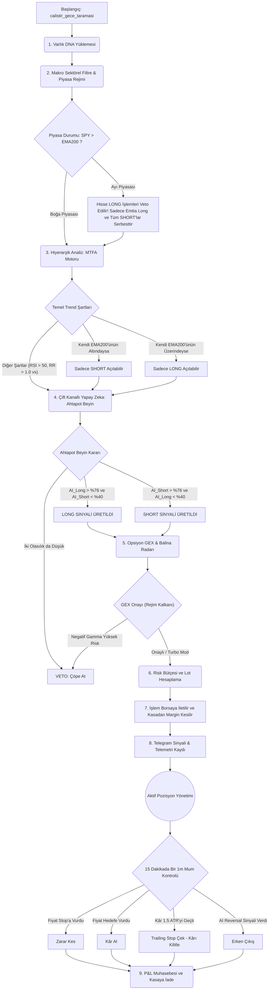

# KUSURSUZ AHTAPOT MİMARİSİ: İŞLEM AKIŞ ŞEMASI (LONG & SHORT ÇİFT YÖNLÜ)

Bu doküman, sistemin piyasayı taramaya başladığı andan pozisyonun kâr/zararla kapanıp kasaya iade edilmesine kadar geçen tüm süreci **Long ve Short persfektifinden** asimetrik olarak listelemektedir.

## 1. ÇİFT YÖNLÜ MİMARİ ŞEMA (MERMAID)

---

## 2. DETAYLI ÇALIŞMA SÜRECİ (ÇİFT YÖNLÜ FİLTRELER)

### A) Piyasa Taraması ve Hazırlık Evresi
Sistem çift yönlüdür; yukarıdan aşağıya (Top-Down) bir hiyerarşi izleyerek hangi yöne işlem açacağına dair "İzin Belgelerini" dağıtır.
1. **DNA Haritalaması:** Her hissenin sektörü ve makro duyarlılığı (Örn: "Teknoloji, VIX'ten negatif etkilenir") belleğe alınır.
2. **Makro Radar ve Rejim Kalkanı:** Genel piyasa (SPY) 200 günlük ortalamasının altındaysa, **"Ayı Piyasası"** ilan edilir.
   - *Ayı Piyasası Devredeyken:* Altın ve emtia hisseleri hariç tüm **LONG (alım) işlemleri bloklanır.**
   - Ancak AI'ın ürettiği **SHORT (Açığa Satış) sinyallerine tam izin verilir.** Kriz anlarında sistem agresif bir açığa satıcıya dönüşür.

### B) Sinyal Filtreleme (Bireysel Hisse Trend Kalkanı)
Bir hisse sıraya girdiğinde, kendi özel durumuna göre işlem yönü kısıtlanır:
1. **Kendi Trendi (EMA 200 Kontrolü):** 
   - Hissenin günlük kapanışı EMA 200'ün **altındaysa**, hisse için `LONG YASAK` bayrağı çekilir. Yapay Zeka sadece SHORT arayabilir.
   - Hissenin günlük kapanışı EMA 200'ün **üzerindeyse**, hisse için `SHORT YASAK` bayrağı çekilir. Yapay Zeka sadece LONG arayabilir.
2. **15 Dakikalık Tetik (Keskin Nişancı):**
   - **LONG İçin:** `Stop = Giriş - 1.5 ATR`, `Hedef = Giriş + 3.0 ATR`
   - **SHORT İçin:** `Stop = Giriş + 1.5 ATR` (Fiyat yukarı çıkarsa zarar ederiz), `Hedef = Giriş - 3.0 ATR` (Fiyat aşağı düşerse kâr ederiz)
   - Risk/Ödül (RR) oranı `1.0`'dan küçük çıkarsa işlem VETO edilir.

### C) Çift Kanallı Yapay Zeka (Ahtapot Inference)
1. 17 teknik ve makro özellikten oluşan 60 mumluk veri dizisi alınır ve `CustomMinMaxScaler` ile standartlaştırılır.
2. Sektör spesifik PyTorch modelleri (Örn: `TEKNOLOJI_long_hiyerarsik_beyin.pth` ve `TEKNOLOJI_short_hiyerarsik_beyin.pth`) aynı anda tetiklenir.
3. Model hem `AI_Olasiligi_Long` hem de `AI_Olasiligi_Short` hesaplar.
   - **LONG Şartı:** Long olasılığı `%76+` ve Short olasılığı `<%40` olmalı.
   - **SHORT Şartı:** Short olasılığı `%76+` ve Long olasılığı `<%40` olmalı. (Çelişkili sinyaller reddedilir).

### D) Zırh Katmanı: Opsiyon GEX ve Balina Radarı
1. **Gamma Rejimi:** Negatif Gamma rejiminde piyasalar sert düşüşlere gebedir.
   - Eğer AI **LONG** sinyali verdiyse ve Negatif Gamma rejimindeysek: Bot lot miktarını **%25'e düşürür** (Defansif defans).
   - Eğer AI **SHORT** sinyali verdiyse ve Negatif Gamma rejimindeysek: Bot lot miktarını **%125'e çıkarır** (Şelale desteği).
2. **Delta İvmesi (Balina Radarı):** Son 15 dakikalık opsiyon ivmesine göre "Gizli Balina Alımı" tespit ederse `1.5x Turbo Lot` yetkisi verir.

### E) Lot Hesaplama ve Alım (Margin Execution)
GEX Motoru onay verdikten sonra matematiksel muhasebe başlar:
1. **Adet Belirleme:** `Riske Edilecek Kasa Miktarı / Risk Başına Dolar (Giriş ile Stop arası fark)`
2. **Short ve Long İşlem Maliyeti:** İşlem yönü ne olursa olsun (Long veya Short), işlem adedi kadar paranın üzerine %0.1 Komisyon ve %0.05 Kayma eklenerek kasadan **"Margin Blokajı"** olarak kesilir.
3. Telegram'a hangi yöne (LONG/SHORT) girildiği, komisyon tutarları ile devasa bir rapor gönderilir.

### F) Çift Yönlü Pozisyon Yönetimi (15-Minute Monitor)
Sistem aktif portföyünü kontrol ederken yön bazlı farklı matematik izler:
1. **Micro-Scan (1m Mum İçi Sızıntı Koruması):**
   - **LONG:** `Low < Stop` ise zararla kapat, `High > Hedef` ise kâr al.
   - **SHORT:** `High > Stop` ise zararla kapat, `Low < Hedef` ise kâr al.
   Gap varsa (Örn: SHORT iken fiyat geceden çok yukarıda açılırsa) gerçek en kötü fiyattan (`open_val`) zarar hesabı yapılır.
2. **Trailing Stop (Kârı Kilitleme):** 
   - LONG kârdayken stop'u yukarı çeker, SHORT kârdayken stop'u (fiyat düştükçe) aşağı çeker.
3. **AI Erken Çıkış (Reversal):**
   - Bir LONG işlemindeyken `AI_Short > %76` sinyali gelirse, fiyata bakmadan işlemi kapatıp nakde geçer.

### G) Kapanış ve P&L Muhasebesi
İşlem kapandığında:
1. **Net P&L:**
   - LONG P&L: `(Çıkış - Giriş) * Adet`
   - SHORT P&L: `(Giriş - Çıkış) * Adet`
2. Serbest bırakılan Margin Blokajı ve Net P&L kasaya iade edilir.
3. Çıkan olay Kara Kutu'ya (Telemetri) `otopsi_sonucunu_guncelle` ile yazılır.

> [!TIP]
> **YENİ FİKİRLER İÇİN MÜDAHALE NOKTALARI:**
> - Short için ayrı bir komisyon veya borçlanma maliyeti (Borrow Fee) eklemek isterseniz: `proje2.py` içindeki `satis_islemi_gerceklestir` muhasebesine.
> - Kendi EMA200'ünün üzerinde olan bir hisseye agresif SHORT vurmak istiyorsanız (Mean Reversion), `spy_trend_short_ok` filtresini geçersiz kılmalısınız.
